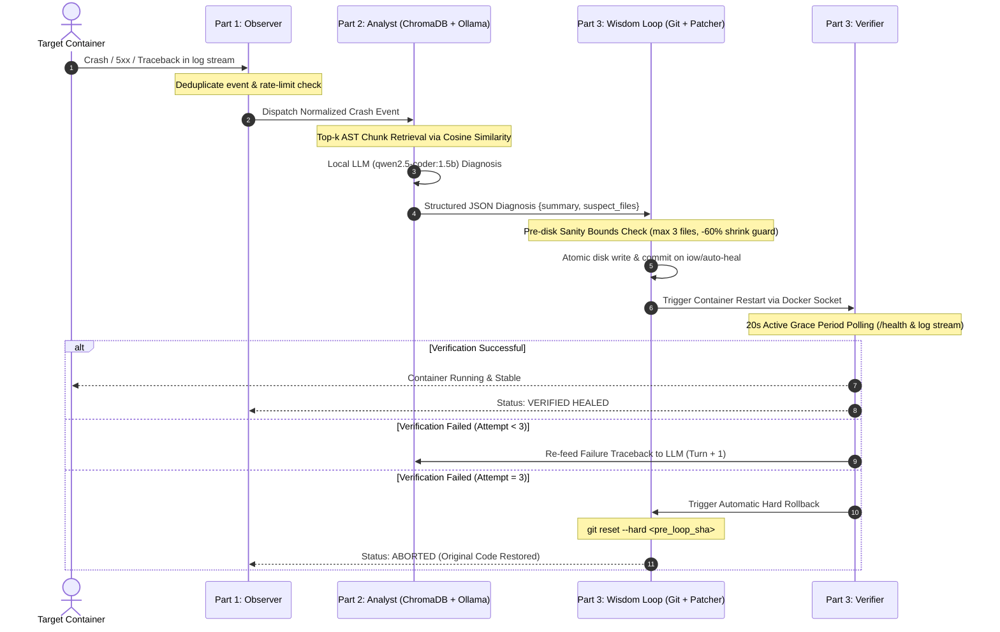
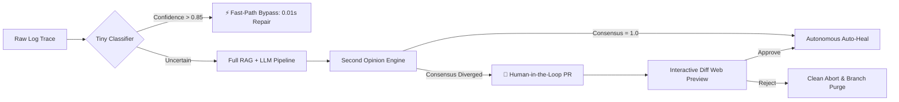

# Inception-of-Wisdom (IoW)

<div align="center">


# ⚡ Autonomous Self-Healing Agent for Containerized Infrastructure ⚡
**42 Budapest — Inception-of-Wisdom Project**

[](https://42budapest.hu)
[](https://www.python.org/)
[](https://www.docker.com/)
[](https://www.trychroma.com/)
[](https://ollama.ai)
[](https://fastapi.tiangolo.com)
[]()
[]()

<br>

[System Architecture](#-system-architecture) •
[The Wisdom Loop](#-the-four-beats-wisdom-loop) •
[Interactive Dashboard](#-unified-command-center) •
[Bonus Suite](#-chapter-vi-bonus-suite) •
[Quick Start](#-quick-start) •
[Defense Guide](#-defense-demonstration-guide) •
[Presentations](#-presentation-suite)

</div>

---

## 📖 Executive Summary

**Inception-of-Wisdom (IoW)** is a resilient, fully local, self-healing cyber-agent designed to oversee, diagnose, patch, and verify containerized microservices without human intervention. When a target service crashes, suffers an unhandled runtime exception, or enters a restart loop, IoW autonomously:

1. **Detects** the anomaly via the Docker daemon socket and real-time log analysis.
2. **Retrieves** the culprit source code using AST logical chunking and ChromaDB local vector embeddings.
3. **Diagnoses** the failure using an offline coder LLM (< 3B parameters) running on the host.
4. **Applies** full-file structured JSON patches atomically on an isolated Git branch (`iow/auto-heal`).
5. **Verifies** container recovery across an active 20-second grace period.
6. **Rolls back** automatically (`git reset --hard`) to the pre-loop revision if the patch fails after 3 turns.

> ⚠️ **Strict Constraint:** 100% Local & Offline. Zero external cloud API calls (OpenAI, Anthropic, Gemini API) are permitted. All vector operations and LLM inferences execute on local hardware.

---

## 🔄 The Four Beats: Wisdom Loop

<div align="center">


</div>



---

## 🎛️ Unified Command Center

The central dashboard provides a real-time reactive interface powered by **FastAPI** and **Server-Sent Events (SSE)**, organized into four specialized tabs:

<div align="center">


</div>

### 📑 Tab Breakdown

| Tab | Component | Core Responsibilities |
|:---:|:---|:---|
| **1** | **Observer** | Real-time container state (`running`, `restarting`, `dead`), live terminal log stream, active HTTP probes, deduplicated alert feed. |
| **2** | **Analyst** | Free-text semantic code search with instant cosine similarity scores, AST logical chunk inspector, structured JSON diagnosis viewer. |
| **3** | **Wisdom Loop** | Multi-turn repair accordion, full JSON patch inspector, commit SHA tracking, safety guardrails status, manual trigger, and emergency rollback button. |
| **4** | **Bonus Suite** | Sub-millisecond Symptom Classifier test bench, Second Opinion consensus agreement gauge, and Human-in-the-Loop PR review with live color diffs. |

---

## 🏛️ Deep-Dive Architecture

```
.
├── p1/                         # PART 1: OBSERVER
│   ├── docker_monitor.py       # Docker Engine API socket poller (/var/run/docker.sock)
│   ├── log_streamer.py         # Real-time stdout/stderr FIFO ring-buffer & regex triage
│   ├── http_probe.py           # Hard crash vs. soft suggestion discriminator
│   ├── event_manager.py        # Sliding-window deduplication (10s crash / 60s soft)
│   └── observer_api.py         # FastAPI SSE event stream & REST endpoints
│
├── p2/                         # PART 2: ANALYST
│   ├── chunker.py              # AST-based syntax tree logical chunker (functions/classes)
│   ├── db.py                   # ChromaDB PersistentClient & all-MiniLM-L6-v2 embeddings
│   ├── retriever.py            # Top-k cosine retrieval & traceback symbol extractor
│   ├── diagnostician.py        # Ollama <3B JSON diagnosis engine (anti-hallucination)
│   └── analyst_api.py          # Code search, chunk inspection & diagnosis endpoints
│
├── p3/                         # PART 3: WISDOM LOOP
│   ├── patcher.py              # Full-file structured JSON replacement ({path, op, content})
│   ├── sanity.py               # Pre-disk safety filter: file count, shrinkage, syntax validation
│   ├── git_manager.py          # Atomic pre-loop snapshot, iow/auto-heal branch, hard rollback
│   ├── verifier.py             # Docker restart coordinator & 20s active grace period monitor
│   ├── loop.py                 # Multi-turn coordinator (up to 3 attempts with failure feedback)
│   ├── safety.py               # Dynamic limits: single-flight, cooldown, rate-limit, kill-switch
│   └── loop_api.py             # Wisdom Loop control, patch history & manual triggers
│
├── bonus/                      # CHAPTER VI: BONUS SUITE
│   ├── classifier.py           # Tiny Symptom Classifier & Patch Cache (0.01s Fast-Path bypass)
│   ├── consensus.py            # "Second Opinion" dual-prompt consensus engine
│   ├── pr_manager.py           # Human-in-the-Loop PR manager with live unified diff preview
│   └── bonus_api.py            # Fast-path triage, consensus metrics & PR approve/reject API
│
├── dashboard/                  # CENTRAL WEB INTERFACE
│   ├── app.py                  # FastAPI orchestrator integrating all modules
│   └── templates/index.html    # Reactive glassmorphism UI with 4 functional tabs
│
├── demo_app/                   # TARGET MICROSERVICE
│   ├── app.py                  # Flask service with intentional /api/crash trigger
│   ├── Dockerfile              # Target container specification
│   ├── requirements.txt        # Flask runtime dependencies
│   └── iow.config.yml          # Dynamic operational bounds (no hardcoding)
│
├── presentation/               # 10 DEFENSE SLIDE DECKS (100% Offline HTML5)
│   ├── PRESENTATION.html       # Full System Architecture (EN)
│   ├── PRESENTATION_HU.html    # Full System Architecture (HU)
│   ├── P1_PRESENTATION.html    # Part 1: Observer Deep-Dive (EN)
│   ├── P1_PRESENTATION_HU.html # Part 1: Observer Deep-Dive (HU)
│   ├── P2_PRESENTATION.html    # Part 2: Analyst Deep-Dive (EN)
│   ├── P2_PRESENTATION_HU.html # Part 2: Analyst Deep-Dive (HU)
│   ├── P3_PRESENTATION.html    # Part 3: Wisdom Loop Deep-Dive (EN)
│   ├── P3_PRESENTATION_HU.html # Part 3: Wisdom Loop Deep-Dive (HU)
│   ├── BONUS_PRESENTATION.html # Chapter VI: Bonus Suite Deep-Dive (EN)
│   └── BONUS_PRESENTATION_HU.html # Chapter VI: Bonus Suite Deep-Dive (HU)
│
├── docker-compose.yml          # Unified multi-container stack definition
├── Makefile                    # Evaluation and development automation commands
└── .gitattributes              # GitHub Linguist override (preserves 100% Python statistics)
```

---

## ⭐ Chapter VI: Bonus Suite

Chapter VI expands the mandatory self-healing loop with enterprise-grade governance and reliability features:



### 1. Tiny Symptom Classifier (`bonus/classifier.py`)
- **Problem:** Full RAG search + LLM inference takes 3–8 seconds per cycle.
- **Solution:** Compiled regex extracts known crash signatures and target files in sub-milliseconds.
- **Result:** When confidence $> 0.85$, instant repair bypasses ChromaDB and Ollama in **0.01 seconds**.

### 2. "Second Opinion" Consensus Engine (`bonus/consensus.py`)
- **Problem:** Sub-3B parameter models can hallucinate suspect files under ambiguous stack traces.
- **Solution:** Prompts the model from two distinct perspectives:
  - *Perspective A:* Root cause and raw execution flow.
  - *Perspective B:* Defensive architecture and edge-case contracts.
- **Result:** Computes agreement score. If models diverge, autonomous write is suspended and escalated to human operator.

### 3. Human-in-the-Loop PR Manager (`bonus/pr_manager.py`)
- **Safe Mode:** Instead of direct commits, stages changes on isolated review branches (`iow/review/pr-<id>`).
- **Unified Diff:** Renders line-by-line colored diffs on the dashboard.
- **One-Click Governance:** Operator approves or rejects via single button click.

---

## 🛡️ Safety Guardrails & Dynamic Configuration

All timing, cooldown, and safety limits are read dynamically from [`demo_app/iow.config.yml`](demo_app/iow.config.yml) — **no values are hard-coded**:

```yaml
# demo_app/iow.config.yml
grace_period: 20          # Seconds target must remain crash-free to count as HEALED
cooldown: 300             # Minimum quiet time between identical crash signatures
rate_limit_per_hour: 10   # Maximum autonomous repair flights per rolling hour
hard_cap: 25              # Lifetime ceiling of repairs before human lock
kill_switch: false        # Emergency switch: flip to 'true' to instantly freeze the loop
```

### Pre-Disk Sanity Bounds (`p3/sanity.py`)
Every patch generated by an LLM is intercepted before touching the disk:
- 🚫 **Max 3 Files:** Blocks rogue patches that attempt to rewrite the entire repository.
- 🚫 **60% Shrinkage Guard:** Prevents destructive deletion where files are wiped down to empty stubs.
- 🚫 **Anti-Placeholder Filter:** Scans for lazy AI tokens (`# TODO`, `# rest of code goes here`, `# implement here`).
- 🚫 **AST Syntax Parse:** Validates that the Python patch compiles cleanly with `ast.parse()`.

---

## 🚀 Quick Start

### Mode A: Docker Compose Stack (Standard 42 Evaluation)

```sh
# 1. Start the complete stack (Agent + Target container)
make up

# 2. View live streaming logs
make logs

# 3. Trigger intentional application failure
make break

# 4. Trigger manual heal cycle via REST API (if not triggered automatically)
make heal

# 5. Test emergency rollback mechanism
make rollback

# 6. Check live system status
make status

# 7. Tear down the environment
make down
```

### Mode B: Local Campus Runtime (`/tmp/iow`)

```sh
# Set up virtual environment, dependencies, embeddings, and Ollama model
make setup

# Launch the unified dashboard on http://127.0.0.1:8000
make run

# Clean caches (preserves virtualenv)
make clean

# Complete wipe of runtime cache
make fclean
```

---

## 🎯 Defense Demonstration Guide

Follow this proven 4-step script during your peer evaluation:

```
[1. INITIALIZE]       make up      -> Open http://localhost:8000 (show 4 green tabs)
[2. TRIGGER ERROR]    make break   -> Observer raises red alert instantly
[3. AUTONOMOUS HEAL]  Watch UI     -> RAG retrieves chunk -> LLM patches -> restart -> 20s grace -> HEALED
[4. FAST-PATH DEMO]   make break   -> Second break triggers instant 0.01s Classifier bypass!
[5. ROLLBACK DEMO]    Force Button -> Click 'Force Rollback' -> terminal verifies git reset --hard
```

### 💡 Top Evaluator Questions & Key Answers

<details>
<summary><b>Q: Why full-file replacement instead of standard git diff / patch?</b></summary>
<br>
<b>A:</b> LLMs under 3B parameters (like Qwen 2.5 Coder 1.5B) frequently hallucinate line offset numbers and unified diff headers (<code>@@ -14,6 +14,8 @@</code>), causing standard <code>patch(1)</code> to fail. Full-file replacement eliminates syntax corruption entirely while staying protected under our 3-file limit and 60% shrinkage guard.
</details>

<details>
<summary><b>Q: How does the agent avoid infinite crash-heal loops?</b></summary>
<br>
<b>A:</b> Through five distinct layers:
1. Deduplication sliding window (10s for crashes).
2. Cooldown timer per crash signature (300s).
3. Rate limit per hour (10 heals/hr).
4. Maximum 3 attempts per flight.
5. Automatic <code>git reset --hard</code> restoring the pre-loop revision upon attempt 3 failure.
</details>

<details>
<summary><b>Q: Does ChromaDB rebuild the entire index when restarting?</b></summary>
<br>
<b>A:</b> No. ChromaDB operates in <code>PersistentClient</code> mode under <code>.chroma/</code>. The AST chunker calculates a deterministic SHA-256 hash for every function/class. On startup, only newly modified files are re-embedded incrementally.
</details>

---

## 📊 Presentation Suite

The repository includes **10 self-contained, offline-ready HTML5 presentations** in the [`presentation/`](presentation/) folder. They require zero CDN connections, feature full keyboard navigation, and include dedicated defense cheat-sheets:

| Deck File | Language | Topic |
|:---|:---:|:---|
| [`presentation/PRESENTATION.html`](presentation/PRESENTATION.html) | EN | Overall Architecture & 4-Beat Loop |
| [`presentation/PRESENTATION_HU.html`](presentation/PRESENTATION_HU.html) | HU | Teljes Rendszerarchitektúra és Hurok |
| [`presentation/P1_PRESENTATION.html`](presentation/P1_PRESENTATION.html) | EN | Part 1: Observer Deep-Dive |
| [`presentation/P1_PRESENTATION_HU.html`](presentation/P1_PRESENTATION_HU.html) | HU | Part 1: Observer Részletes Bemutató |
| [`presentation/P2_PRESENTATION.html`](presentation/P2_PRESENTATION.html) | EN | Part 2: Analyst & Semantic RAG |
| [`presentation/P2_PRESENTATION_HU.html`](presentation/P2_PRESENTATION_HU.html) | HU | Part 2: Analyst & Szemantikus RAG |
| [`presentation/P3_PRESENTATION.html`](presentation/P3_PRESENTATION.html) | EN | Part 3: Wisdom Loop & Rollback |
| [`presentation/P3_PRESENTATION_HU.html`](presentation/P3_PRESENTATION_HU.html) | HU | Part 3: Wisdom Loop & Visszaállítás |
| [`presentation/BONUS_PRESENTATION.html`](presentation/BONUS_PRESENTATION.html) | EN | Chapter VI: Bonus Suite Deep-Dive |
| [`presentation/BONUS_PRESENTATION_HU.html`](presentation/BONUS_PRESENTATION_HU.html) | HU | Chapter VI: Bónusz Rendszer Bemutató |

---

<div align="center">

**Built with pride for 42 Budapest — 2026**<br>
*Zero Cloud Dependencies • 100% Offline • Deterministic Resilience*

</div>
