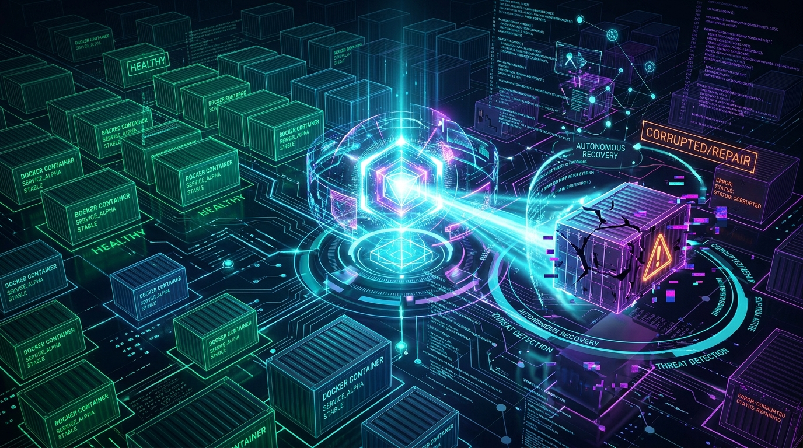
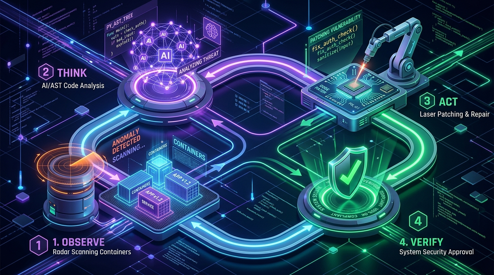
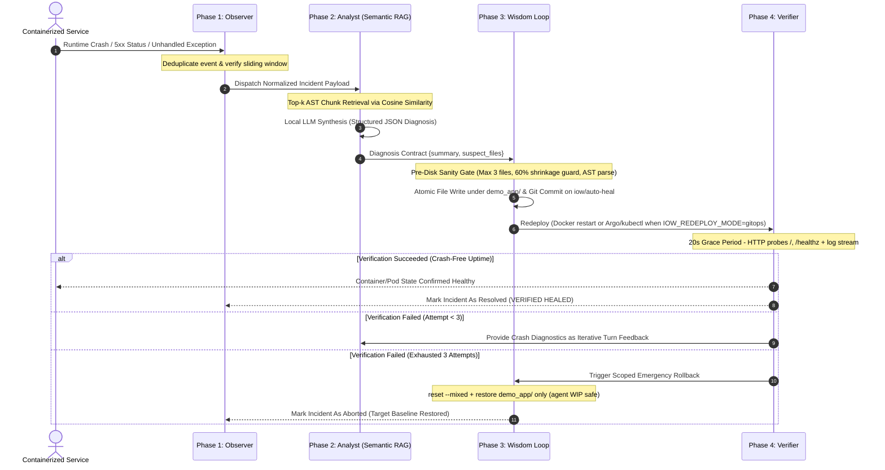
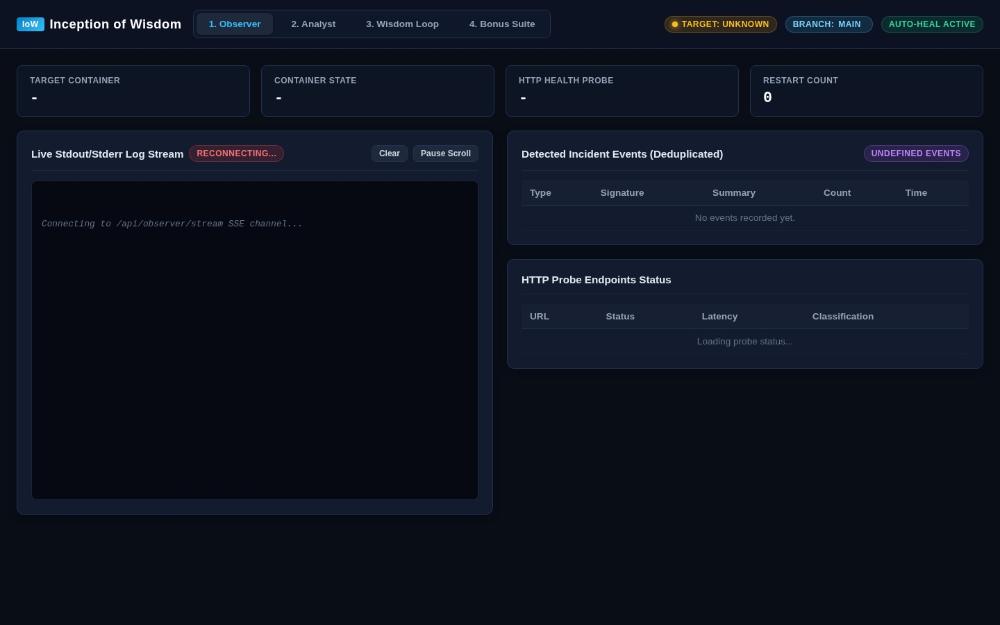
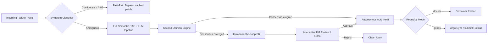

# Inception-of-Wisdom (IoW)

<div align="center">



# Enterprise Autonomous Self-Healing Platform for Containerized Infrastructure
**Continuous Reliability • Intelligent Root-Cause Analysis • Automated Zero-Downtime Remediation**

[](https://www.python.org/)
[](https://www.docker.com/)
[](https://www.trychroma.com/)
[](https://ollama.ai)
[](https://fastapi.tiangolo.com)
[]()
[]()

<br>

[System Architecture](#-system-architecture) •
[Autonomous Resilience Workflow](#-autonomous-resilience-workflow) •
[Unified Observability Center](#-unified-observability-center) •
[Enterprise Reliability Extensions](#-enterprise-reliability-extensions) •
[Production Guardrails](#-production-guardrails--configuration) •
[Operational Guide](#-operational-guide) •
[Interactive Documentation](#-interactive-documentation)

</div>

---

## Executive Overview

**Inception-of-Wisdom (IoW)** is a production-grade autonomous site-reliability and self-healing agent engineered for containerized application stacks. By continuously intercepting infrastructure telemetry, real-time log streams, and HTTP synthetic health probes, IoW detects operational failures, identifies root causes through semantic code analysis, synthesizes corrective patches, and validates service recovery.

### Core Architectural Principles

* **100% Air-Gapped & Local:** All machine learning inference (embeddings via `all-MiniLM-L6-v2` and code diagnosis via `Qwen 2.5 Coder 1.5B`) runs entirely on local host hardware. No proprietary cloud LLM APIs are called, guaranteeing total data sovereignty and zero telemetry egress.
* **Deterministic AST Code Intelligence:** Application source code is parsed into Abstract Syntax Trees, preserving discrete function and class boundaries rather than using arbitrary character chunking.
* **Non-Destructive Atomic Patching:** Corrective changes are structured as full-file replacements and validated through strict pre-disk sanity boundaries, preventing partial corruptions and syntax regressions.
* **Scoped Rollback Guarantee:** The loop never checks a branch out. Heal commits are written onto `iow/auto-heal` with git plumbing (`hash-object` / `commit-tree` / `update-ref`), so HEAD, your branch and every file outside `demo_app/` stay exactly where you left them. If verification fails after the maximum retry turns (default: 3), only the heal-scoped paths are restored to the pre-loop snapshot.

---

## Autonomous Resilience Workflow

<div align="center">



</div>

The remediation engine operates across four deterministic phases:



---

## Unified Observability Center

The centralized administrative interface provides a modern SRE console powered by **FastAPI** and **Server-Sent Events (SSE)**:

<div align="center">



</div>

### Functional Modules

| Module | Component | Description |
|:---|:---|:---|
| **1. Observer** | `p1/observer_api.py` | Live container lifecycle telemetry (`running`, `restarting`, `dead`), real-time FIFO log streaming, active synthetic HTTP probes, and deduplicated incident log. |
| **2. Analyst** | `p2/analyst_api.py` | Semantic vector search across indexed codebase chunks, real-time cosine similarity ranking, and structured root-cause diagnostic reports. |
| **3. Wisdom Loop** | `p3/loop_api.py` | Multi-turn remediation history, full-file JSON patch inspector, commit SHA tracking, dynamic safety metrics, manual remediation trigger, and force rollback. |
| **4. Extensions** | `bonus/bonus_api.py` | Symptom classifier stats, Second Opinion consensus tester, Gitea HITL / verified PR queue, and GitOps redeploy hooks (`bonus/gitops.py`). |

---

## System Architecture & Subsystems

```
.
├── p1/                         # PHASE 1: TELEMETRY & OBSERVATION
│   ├── docker_monitor.py       # Unix socket event monitoring (/var/run/docker.sock)
│   ├── log_streamer.py         # Real-time stdout/stderr stream parser & regex triage
│   ├── http_probe.py           # Discriminates hard crashes from soft suggestions (4xx vs 5xx)
│   ├── event_manager.py        # Sliding-window incident deduplication (10s crash / 60s soft)
│   └── observer_api.py         # Reactive SSE stream & telemetry REST endpoints
│
├── p2/                         # PHASE 2: SEMANTIC CODE ANALYSIS
│   ├── chunker.py              # AST-based syntax tree logical chunker (functions/classes)
│   ├── db.py                   # Persistent ChromaDB client & local embedding pipeline
│   ├── retriever.py            # Top-k cosine similarity retrieval & stacktrace symbol extraction
│   ├── diagnostician.py        # Host-based local LLM structured JSON diagnostic generator
│   └── analyst_api.py          # Semantic code search & diagnostic query endpoints
│
├── p3/                         # PHASE 3 & 4: REMEDIATION & VERIFICATION
│   ├── patcher.py              # Full-file LLM patches + surgical intentional-crash disarm
│   ├── sanity.py               # Pre-disk safety filter: file count, shrinkage & AST validation
│   ├── git_manager.py          # Heal scoped to demo_app/; iow/auto-heal; mixed rollback
│   ├── verifier.py             # Docker restart or GitOps (Argo/kubectl) + 20s grace
│   ├── loop.py                 # Multi-turn coordinator (up to 3 attempts with failure feedback)
│   ├── safety.py               # Production guardrails: single-flight, cooldown, rate-limit, kill-switch
│   └── loop_api.py             # Remediation orchestration & emergency rollback API
│
├── bonus/                      # ENTERPRISE RELIABILITY EXTENSIONS
│   ├── classifier.py           # Sub-millisecond symptom classifier (0.01s Fast-Path bypass)
│   ├── consensus.py            # "Second Opinion" dual-perspective consensus engine
│   ├── pr_manager.py           # Human-in-the-Loop PR review manager with live unified diff
│   ├── gitops.py               # Argo CD/kubectl rollout verification for GitOps mode
│   └── bonus_api.py            # Fast-path triage, consensus scoring & PR approval endpoints
│
├── k8s/                        # ARGO CD DESIRED STATE
│   └── demo-app/               # Namespace, Deployment and NodePort manifests
│
├── scripts/                    # CAMPUS-SAFE GITOPS BOOTSTRAP & OPERATIONS
│   ├── argocd_bonus_up.sh      # Creates iow-k3s and installs/configures Argo CD
│   ├── argocd_bonus_down.sh    # Removes the GitOps runtime
│   ├── ensure_gitops_tools.sh  # Installs kubectl/argocd under /tmp/iow/bin
│   └── gitops_doctor.sh        # Diagnoses and optionally purges broken GitOps state
│
├── dashboard/                  # UNIFIED OPERATIONS DASHBOARD
│   ├── app.py                  # Central FastAPI application uniting all subsystems
│   └── templates/index.html    # Modern SRE interface with 4 functional tabs
│
├── demo_app/                   # TARGET APPLICATION SUITE
│   ├── app.py                  # Containerized service featuring synthetic failure endpoints
│   ├── Dockerfile              # Target microservice container definition
│   ├── requirements.txt        # Runtime dependencies
│   └── iow.config.yml          # Production limits & operational timing parameters
│
├── presentation/               # TECHNICAL DOCUMENTATION SUITE (10 Offline Decks)
│   ├── PRESENTATION.html       # Complete Architecture Overview (EN)
│   ├── PRESENTATION_HU.html    # Teljes Rendszerarchitektúra (HU)
│   ├── P1_PRESENTATION.html    # Phase 1: Observer Deep-Dive (EN)
│   ├── P1_PRESENTATION_HU.html # Phase 1: Observer Részletes Bemutató (HU)
│   ├── P2_PRESENTATION.html    # Phase 2: Analyst & Semantic RAG (EN)
│   ├── P2_PRESENTATION_HU.html # Phase 2: Analyst & Szemantikus RAG (HU)
│   ├── P3_PRESENTATION.html    # Phase 3: Remediation & Rollback (EN)
│   ├── P3_PRESENTATION_HU.html # Phase 3: Javítás és Visszaállítás (HU)
│   ├── BONUS_PRESENTATION.html # Enterprise Extensions Deep-Dive (EN)
│   └── BONUS_PRESENTATION_HU.html # Vállalati Kiegészítések Bemutató (HU)
│
├── docker-compose.yml          # Orchestrated multi-container stack definition
├── Makefile                    # Operational commands and build workflows
└── .gitattributes              # Language metadata configuration (100% Python)
```

---

## Enterprise Reliability Extensions

To meet rigorous production reliability and compliance standards, the platform includes four governance extensions:



### 1. Sub-Millisecond Symptom Classifier (`bonus/classifier.py`)
* **Objective:** Eliminate LLM latency for deterministic, known failure modes.
* **Mechanism:** Extracts exception signatures / stack coordinates; stores verified heals under `/tmp/iow/classifier_store.json`.
* **Governance:** When confidence exceeds **0.85** and a cached patch exists, the heal path can bypass vector search + LLM (`fast_path_classifier` flag).
* **Test:** Bonus tab → classifier stats; heals after a verified fix train the store for the next identical crash.

### 2. "Second Opinion" Consensus Engine (`bonus/consensus.py`)
* **Objective:** Mitigate single-prompt hallucination in sub-3B parameter models.
* **Mechanism:** Two independent prompts (root-cause vs defensive architecture) vote on suspect files.
* **Governance:** Agreement → autonomous patch may proceed. Divergence → HITL / review path (`second_opinion_mandatory`, default on).
* **Test:** Bonus tab → **Second Opinion Consensus Tester**, or `POST /api/bonus/consensus/evaluate`.

### 3. Human-in-the-Loop PR Manager (`bonus/pr_manager.py`)
* **Objective:** Auditable change management via local **Gitea** (`make pr-bonus` / `make gitea`).
* **Mechanism:** Review branches `iow/review/...` with dashboard diffs; verified heals can open `iow/auto-heal` → `main` PRs when HITL is off.
* **Credentials:** `/tmp/iow/gitea/gitea.env` - UI http://127.0.0.1:3000 (`iow` / `iowiow123`).
* **API:** `GET /api/bonus/prs`, `POST /api/bonus/prs/create`, `/prs/{id}/merge`, `/prs/{id}/reject`.

### 4. GitOps Redeploy (`bonus/gitops.py` + `make argocd-bonus`)
* **Objective:** After a heal commit, redeploy the target via **Argo CD** / kubectl instead of only Docker restart.
* **Campus path:** Nested k3d fails under rootless Docker (missing `cpu` cgroup). Bootstrap runs **`iow-k3s`** - privileged k3s-in-Docker with `--cgroupns=host` - then installs Argo CD and syncs from Gitea over `iow-network`. Each run rebuilds `inception-of-wisdom-demo_app:latest` from root `demo_app/`, imports it into k3s, and publishes both `demo_app/` and `k8s/demo-app` to Gitea so the cluster app matches compose (`:5001`).
* **URLs:** Argo UI http://127.0.0.1:8080 (`admin` / password printed by make); in-cluster demo NodePort http://127.0.0.1:30051; dashboard http://127.0.0.1:8000.
* **Ops:** `make gitops-doctor` / `make gitops-doctor-purge` / `make argocd-bonus-down` / `make ensure-gitops-tools`.

---

## Production Guardrails & Configuration

Operational limits are loaded dynamically from [`demo_app/iow.config.yml`](demo_app/iow.config.yml) (subject requirement - do not hard-code timings in application logic). Defaults:

```yaml
# demo_app/iow.config.yml
grace_period: 20          # Seconds the target must remain stable to confirm recovery
cooldown: 300             # Minimum seconds before the same incident signature may retrigger
rate_limit_per_hour: 5    # Maximum autonomous remediation flights per rolling hour
hard_cap: 20              # Absolute total lifecycle remediation operations before manual reset
kill_switch: false        # Immediate global kill-switch: set to true to refuse all actions

target:
  probe_urls: ["/", "/healthz"]   # Synthetic HTTP probes (not /health or /crash)
```

### Pre-Disk Sanity Filters (`p3/sanity.py`)
Before any AI-generated patch is applied to the filesystem, it must satisfy four immutable validation criteria:
1. **File Count Bound:** Maximum 3 files modified per operation.
2. **Shrinkage Guard:** File size cannot decrease by more than 60% vs baseline.
3. **Anti-Placeholder Filter:** Rejects stubs (`# TODO`, `# implement here`, ...).
4. **AST Syntax Parse:** Modified Python must compile before disk write.

Heal writes and rollback are **scoped to `demo_app/`** (`p3/git_manager.py`), and the
loop never checks out a branch, so agent/dashboard WIP is never touched. There is no
canned answer for any particular bug: if the model truncates a file the Patcher asks
it again with an explicit length requirement, and if it still fails the attempt fails
honestly (`p3/patcher.py`). Stopping Ollama makes the Analyst report an explicit
failure rather than inventing a culprit.

---

## Operational Guide

### Ports (quick map)

| Port | Service |
|:---:|:---|
| **8000** | Dashboard (host `make bonus` / `p1`–`p3` / `run`, or `make up-agent`) |
| **5001** | Docker demo target (`iow_demo_target` → container :5000) |
| **3000** | Local Gitea forge |
| **30051** | In-cluster demo NodePort after `argocd-bonus` |
| **8080** | Argo CD UI (port-forwarded by `argocd-bonus`) |
| **6550** | k3s API (`iow-k3s`) |
| **11436** | IoW Ollama (avoids campus :11434 / IoC :11435) |

### Primary Workflow

**Everything in one command (subject entry point).** Brings up the agent, the local
LLM runtime and the demo target together:

```sh
export DOCKER_SOCK="$XDG_RUNTIME_DIR/docker.sock"   # rootless Docker only (42 campus)
docker compose up --build                            # agent + ollama + demo_app + gitea
# dashboard → http://127.0.0.1:8000
```

**Host workflow (faster on campus: reuses one Ollama and one venv under `/tmp/iow`):**

```sh
make setup                 # once (or after fclean) - venv, deps, embeddings, ollama
make up                    # demo_app + gitea; leaves :8000 free for host dashboard
make p3                    # dashboard :8000 with the Wisdom Loop unlocked
# or: make bonus           # + classifier / consensus
# or: make pr-bonus        # + Gitea HITL / verified PRs
# or: make argocd-bonus    # + iow-k3s + Argo CD GitOps

make break                 # soft crash: HTTP 500 + traceback, process survives
make break-hard            # hard crash: target exits 1 (exit-code detection)
make break-import          # startup crash: missing import → restart loop
make suggest               # 4xx probe → suggestion, flagged but never auto-healed
make heal                  # optional manual heal trigger
make status
make logs
make down                  # stop compose stack
```

### Which stage does what

Observation is always live; patching waits for the stage that owns Part 3.

| Command | Observer | Analyst | Wisdom Loop | Bonus |
|:--|:--:|:--:|:--:|:--:|
| `make p1` | yes | locked | locked | locked |
| `make p2` | yes | yes | locked | locked |
| `make p3` | yes | yes | **yes** | locked |
| `make bonus` / `pr-bonus` / `argocd-bonus` / `run` | yes | yes | yes | **yes** |

In `p1` and `p2` the loop endpoints answer `409` instead of patching, so a peer can
step through the parts without the agent quietly committing behind the locked tab.

### Bonus / GitOps targets

```sh
make bonus                 # classifier + consensus (Bonus tab)
make pr-bonus              # + Gitea forge + HITL / verified heal PRs
make argocd-bonus          # + k3s-in-Docker + Argo CD (CLIs → /tmp/iow/bin)
make argocd-bonus-down     # delete iow-k3s (+ legacy k3d leftovers)
make ensure-gitops-tools   # kubectl / argocd only
make gitops-doctor         # inspect compose vs iow-k3s
make gitops-doctor-purge   # wipe broken GitOps only (keep demo/gitea)
make gitea                 # forge only → http://127.0.0.1:3000
make up-agent              # optional: dashboard inside Docker on :8000
make docker-restart        # recreate demo + gitea (not iow_agent)
make docker-clean          # stop IoW containers (keep images)
make docker-fclean         # remove IoW containers + images (compose/Gitea/k3s/alpine)
```

Credentials: `/tmp/iow/gitea/gitea.env` (user `iow`, pass `iowiow123`).  
GitOps env: `/tmp/iow/gitops/env` - demo `http://127.0.0.1:30051`.

Campus: nested **k3d** fails under rootless Docker (`failed to find cpu cgroup (v2)`).  
`make argocd-bonus` uses privileged **`iow-k3s`** + `--cgroupns=host`, attaches to `iow-network` for Gitea, rebuilds/imports the same `demo_app` image as compose, syncs `demo_app/` + manifests to Gitea, and port-forwards Argo to :8080.

```sh
source /tmp/iow/gitops/path.env
kubectl get nodes
kubectl -n iow-demo get pods,svc
# Argo CD: http://127.0.0.1:8080  (admin / password printed by make argocd-bonus)
```

### Runtime under `/tmp/iow`

```sh
make setup                 # venv + pip + embeddings + ollama on :11436
make run                   # all tabs unlocked on :8000
make clean                 # wipe chroma / caches under /tmp/iow (keep tools optional)
make fclean                # docker-fclean + full wipe of /tmp/iow
make re                    # fclean + setup
```

`ensure-ready` auto-runs `make setup` if the venv/deps are missing (e.g. after `fclean`).

---

## Technical Deep-Dives & FAQs

<details>
<summary><b>Why full-file replacement instead of unified diffs (git apply)?</b></summary>
<br>
Small LLMs (< 3B parameters) struggle with character-accurate arithmetic required for unified diff line offsets (<code>@@ -12,4 +12,6 @@</code>). Attempting to apply hallucinated diff headers results in rejection by standard patch utilities. Structured full-file replacement provides deterministic, reliable code application while remaining strictly governed by our file-count and shrinkage guards.
</details>

<details>
<summary><b>How are infinite restart and patch loops prevented?</b></summary>
<br>
Through a layered defense-in-depth approach:
1. Event deduplication sliding window (10 seconds for crashes).
2. Per-signature cooldown periods (300 seconds).
3. Rolling hourly rate-limits (<strong>5</strong> heals/hour) and hard lifetime caps (<strong>20</strong>) from <code>iow.config.yml</code>.
4. Turn-limited remediation flights (maximum 3 attempts).
5. Scoped rollback restoring <code>demo_app/</code> to the pre-loop revision if stability is not confirmed within the grace period.
</details>

<details>
<summary><b>How does incremental indexing work in ChromaDB?</b></summary>
<br>
ChromaDB runs as a <code>PersistentClient</code> under <code>/tmp/iow/chroma_db</code> (see <code>CHROMA_CACHE_DIR</code>). The AST parser computes a SHA-256 hash per function/class chunk; only changed hashes are re-embedded on sync.
</details>

<details>
<summary><b>Why not nested k3d on campus?</b></summary>
<br>
Rootless Docker only delegates <code>memory</code>/<code>pids</code> cgroup controllers to the user. Nested k3d/k3s fatals with <code>failed to find cpu cgroup (v2)</code>. IoW uses a single privileged <code>iow-k3s</code> container with <code>--cgroupns=host</code> and kubelet flags for user namespaces, then installs Argo CD inside that cluster.
</details>

---

## Interactive Documentation

Ten self-contained, offline-compatible HTML5 technical presentations are available in the [`presentation/`](presentation/) directory. They require no internet connection, feature full keyboard navigation, and include architectural walkthroughs:

| Deck | Language | Focus |
|:---|:---:|:---|
| [`presentation/PRESENTATION.html`](presentation/PRESENTATION.html) | EN | Overall System Architecture & The 4-Phase Loop |
| [`presentation/PRESENTATION_HU.html`](presentation/PRESENTATION_HU.html) | HU | Teljes Rendszerarchitektúra és Működési Hurok |
| [`presentation/P1_PRESENTATION.html`](presentation/P1_PRESENTATION.html) | EN | Phase 1: Observation, Telemetry & Ingestion |
| [`presentation/P1_PRESENTATION_HU.html`](presentation/P1_PRESENTATION_HU.html) | HU | 1. Fázis: Megfigyelés, Telemetria és Eseménykezelés |
| [`presentation/P2_PRESENTATION.html`](presentation/P2_PRESENTATION.html) | EN | Phase 2: AST Analysis, Vector Storage & LLM Diagnosis |
| [`presentation/P2_PRESENTATION_HU.html`](presentation/P2_PRESENTATION_HU.html) | HU | 2. Fázis: AST Elemzés, Vektoros Keresés és Diagnosztika |
| [`presentation/P3_PRESENTATION.html`](presentation/P3_PRESENTATION.html) | EN | Phase 3: Patch Synthesis, Verification & Atomic Rollback |
| [`presentation/P3_PRESENTATION_HU.html`](presentation/P3_PRESENTATION_HU.html) | HU | 3. Fázis: Javítás, Verifikáció és Atomikus Rollback |
| [`presentation/BONUS_PRESENTATION.html`](presentation/BONUS_PRESENTATION.html) | EN | Enterprise Reliability Extensions & Governance |
| [`presentation/BONUS_PRESENTATION_HU.html`](presentation/BONUS_PRESENTATION_HU.html) | HU | Vállalati Megbízhatósági Bővítmények és Felügyelet |

---

<div align="center">

**Inception-of-Wisdom (IoW)**<br>
*Deterministic Incident Response • 100% Air-Gapped Operation • Continuous Availability*

</div>
