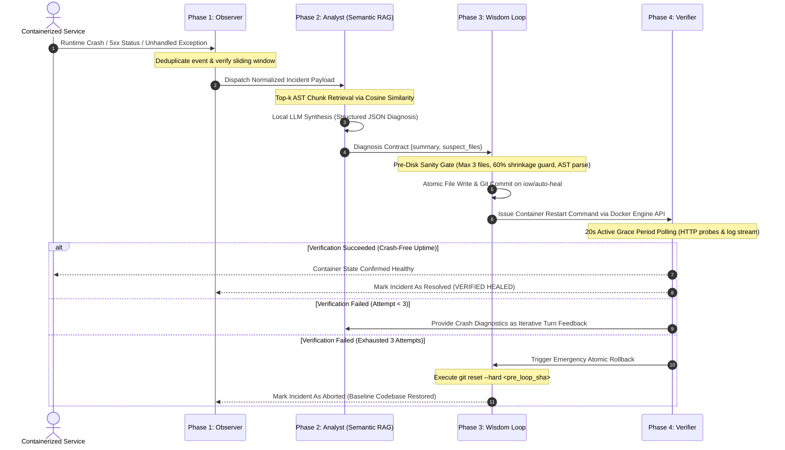
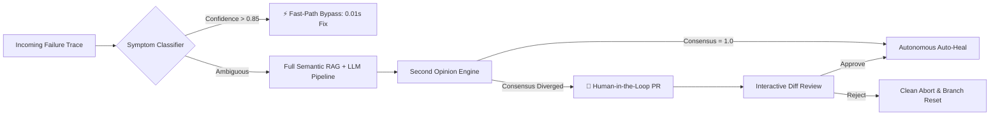

# Inception-of-Wisdom (IoW)

<div align="center">


# Enterprise Autonomous Self-Healing Platform for Containerized Infrastructure
**Continuous Reliability • Intelligent Root-Cause Analysis • Automated Zero-Downtime Remediation**

[](https://www.python.org/)
[](https://www.docker.com/)
[](https://www.trychroma.com/)
[](https://ollama.ai)
[](https://fastapi.tiangolo.com)
[]()
[]()

<br>

[System Architecture](#-system-architecture) •
[Autonomous Resilience Workflow](#-autonomous-resilience-workflow) •
[Unified Observability Center](#-unified-observability-center) •
[Enterprise Reliability Extensions](#-enterprise-reliability-extensions) •
[Production Guardrails](#-production-guardrails--configuration) •
[Operational Guide](#-operational-guide) •
[Interactive Documentation](#-interactive-documentation)

</div>

---

## 📌 Executive Overview

**Inception-of-Wisdom (IoW)** is a production-grade autonomous site-reliability and self-healing agent engineered for containerized application stacks. By continuously intercepting infrastructure telemetry, real-time log streams, and HTTP synthetic health probes, IoW detects operational failures, identifies root causes through semantic code analysis, synthesizes corrective patches, and validates service recovery.

### Core Architectural Principles

* **100% Air-Gapped & Local:** All machine learning inference (embeddings via `all-MiniLM-L6-v2` and code diagnosis via `Qwen 2.5 Coder 1.5B`) runs entirely on local host hardware. No proprietary cloud LLM APIs are called, guaranteeing total data sovereignty and zero telemetry egress.
* **Deterministic AST Code Intelligence:** Application source code is parsed into Abstract Syntax Trees, preserving discrete function and class boundaries rather than using arbitrary character chunking.
* **Non-Destructive Atomic Patching:** Corrective changes are structured as full-file replacements and validated through strict pre-disk sanity boundaries, preventing partial corruptions and syntax regressions.
* **Automated Rollback Guarantee:** If verification fails after maximum retry turns (default: 3), the repository executes an immediate `git reset --hard` to the baseline revision, returning the application to a clean, known-good state.

---

## 🔄 Autonomous Resilience Workflow

<div align="center">


</div>

The remediation engine operates across four deterministic phases:



---

## 🖥️ Unified Observability Center

The centralized administrative interface provides a modern SRE console powered by **FastAPI** and **Server-Sent Events (SSE)**:

<div align="center">


</div>

### Functional Modules

| Module | Component | Description |
|:---|:---|:---|
| **1. Observer** | `p1/observer_api.py` | Live container lifecycle telemetry (`running`, `restarting`, `dead`), real-time FIFO log streaming, active synthetic HTTP probes, and deduplicated incident log. |
| **2. Analyst** | `p2/analyst_api.py` | Semantic vector search across indexed codebase chunks, real-time cosine similarity ranking, and structured root-cause diagnostic reports. |
| **3. Wisdom Loop** | `p3/loop_api.py` | Multi-turn remediation history, full-file JSON patch inspector, commit SHA tracking, dynamic safety metrics, manual remediation trigger, and force rollback. |
| **4. Extensions** | `bonus/bonus_api.py` | Sub-millisecond symptom classifier test bench, dual-prompt consensus evaluation gauge, and Human-in-the-Loop review queue with live color-coded diffs. |

---

## ⚙️ System Architecture & Subsystems

```
.
├── p1/                         # PHASE 1: TELEMETRY & OBSERVATION
│   ├── docker_monitor.py       # Unix socket event monitoring (/var/run/docker.sock)
│   ├── log_streamer.py         # Real-time stdout/stderr stream parser & regex triage
│   ├── http_probe.py           # Discriminates hard crashes from soft suggestions (4xx vs 5xx)
│   ├── event_manager.py        # Sliding-window incident deduplication (10s crash / 60s soft)
│   └── observer_api.py         # Reactive SSE stream & telemetry REST endpoints
│
├── p2/                         # PHASE 2: SEMANTIC CODE ANALYSIS
│   ├── chunker.py              # AST-based syntax tree logical chunker (functions/classes)
│   ├── db.py                   # Persistent ChromaDB client & local embedding pipeline
│   ├── retriever.py            # Top-k cosine similarity retrieval & stacktrace symbol extraction
│   ├── diagnostician.py        # Host-based local LLM structured JSON diagnostic generator
│   └── analyst_api.py          # Semantic code search & diagnostic query endpoints
│
├── p3/                         # PHASE 3 & 4: REMEDIATION & VERIFICATION
│   ├── patcher.py              # Structured full-file replacement ({path, op, content})
│   ├── sanity.py               # Pre-disk safety filter: file count, shrinkage & AST validation
│   ├── git_manager.py          # Atomic pre-loop snapshot, iow/auto-heal branch, hard rollback
│   ├── verifier.py             # Docker restart manager & 20s active grace period verifier
│   ├── loop.py                 # Multi-turn coordinator (up to 3 attempts with failure feedback)
│   ├── safety.py               # Production guardrails: single-flight, cooldown, rate-limit, kill-switch
│   └── loop_api.py             # Remediation orchestration & emergency rollback API
│
├── bonus/                      # ENTERPRISE RELIABILITY EXTENSIONS
│   ├── classifier.py           # Sub-millisecond symptom classifier (0.01s Fast-Path bypass)
│   ├── consensus.py            # "Second Opinion" dual-perspective consensus engine
│   ├── pr_manager.py           # Human-in-the-Loop PR review manager with live unified diff
│   └── bonus_api.py            # Fast-path triage, consensus scoring & PR approval endpoints
│
├── dashboard/                  # UNIFIED OPERATIONS DASHBOARD
│   ├── app.py                  # Central FastAPI application uniting all subsystems
│   └── templates/index.html    # Modern SRE interface with 4 functional tabs
│
├── demo_app/                   # TARGET APPLICATION SUITE
│   ├── app.py                  # Containerized service featuring synthetic failure endpoints
│   ├── Dockerfile              # Target microservice container definition
│   ├── requirements.txt        # Runtime dependencies
│   └── iow.config.yml          # Production limits & operational timing parameters
│
├── presentation/               # TECHNICAL DOCUMENTATION SUITE (10 Offline Decks)
│   ├── PRESENTATION.html       # Complete Architecture Overview (EN)
│   ├── PRESENTATION_HU.html    # Teljes Rendszerarchitektúra (HU)
│   ├── P1_PRESENTATION.html    # Phase 1: Observer Deep-Dive (EN)
│   ├── P1_PRESENTATION_HU.html # Phase 1: Observer Részletes Bemutató (HU)
│   ├── P2_PRESENTATION.html    # Phase 2: Analyst & Semantic RAG (EN)
│   ├── P2_PRESENTATION_HU.html # Phase 2: Analyst & Szemantikus RAG (HU)
│   ├── P3_PRESENTATION.html    # Phase 3: Remediation & Rollback (EN)
│   ├── P3_PRESENTATION_HU.html # Phase 3: Javítás és Visszaállítás (HU)
│   ├── BONUS_PRESENTATION.html # Enterprise Extensions Deep-Dive (EN)
│   └── BONUS_PRESENTATION_HU.html # Vállalati Kiegészítések Bemutató (HU)
│
├── docker-compose.yml          # Orchestrated multi-container stack definition
├── Makefile                    # Operational commands and build workflows
└── .gitattributes              # Language metadata configuration (100% Python)
```

---

## 🌟 Enterprise Reliability Extensions

To meet rigorous production reliability and compliance standards, the platform includes three high-speed governance extensions:



### 1. Sub-Millisecond Symptom Classifier (`bonus/classifier.py`)
* **Objective:** Eliminate LLM latency for deterministic, known failure modes.
* **Mechanism:** Pre-compiled regular expressions extract exception signatures, module paths, and stacktrace coordinates in under 1 millisecond.
* **Performance:** When confidence exceeds 0.85, the platform executes a verified patch in **0.01 seconds**, bypassing vector search and LLM compute overhead.

### 2. "Second Opinion" Consensus Engine (`bonus/consensus.py`)
* **Objective:** Mitigate single-prompt hallucination in sub-3B parameter models.
* **Mechanism:** Evaluates the incident from two independent reasoning perspectives:
  * *Perspective A (Root Cause Analysis):* Focuses on the immediate call-stack trace and execution context.
  * *Perspective B (Defensive Architecture):* Focuses on defensive contracts, bounds checking, and input validation.
* **Governance:** If both models agree on the target suspect file, autonomous remediation proceeds. If findings diverge, the incident is safely flagged for human evaluation.

### 3. Human-in-the-Loop PR Manager (`bonus/pr_manager.py`)
* **Objective:** Provide auditable change management in environments prohibiting fully autonomous writes to production branches.
* **Mechanism:** Stages candidate patches on dedicated review branches (`iow/review/pr-<timestamp>`).
* **Interface:** Generates syntax-highlighted unified diffs directly on the dashboard, allowing operations teams to review, approve, or reject changes with a single click.

---

## 🛡️ Production Guardrails & Configuration

All system limits, timing parameters, and safety thresholds are configured dynamically in [`demo_app/iow.config.yml`](demo_app/iow.config.yml) — **no values are hard-coded in source files**:

```yaml
# demo_app/iow.config.yml
grace_period: 20          # Seconds the target must remain stable to confirm recovery
cooldown: 300             # Minimum seconds before the same incident signature may retrigger
rate_limit_per_hour: 10   # Maximum autonomous remediation flights allowed per rolling hour
hard_cap: 25              # Absolute total lifecycle remediation operations before manual reset
kill_switch: false        # Immediate global kill-switch: set to true to refuse all actions
```

### Pre-Disk Sanity Filters (`p3/sanity.py`)
Before any AI-generated patch is applied to the filesystem, it must satisfy four immutable validation criteria:
1. **File Count Bound:** Maximum 3 files modified per operation to prevent broad unintended modifications.
2. **Shrinkage Guard:** The file size cannot decrease by more than 60% compared to baseline (protects against destructive truncation).
3. **Anti-Placeholder Filter:** Rejects code containing stubs (`# TODO`, `# implement here`, `# rest of code`).
4. **AST Syntax Parse:** Validates that modified Python code compiles cleanly without syntax errors before disk write.

---

## 🚀 Operational Guide

### Primary Workflow: Docker Compose Orchestration

```sh
# 1. Build and bring up the complete stack (Agent + Target container)
make up

# 2. Follow unified live container logs
make logs

# 3. Trigger a synthetic runtime crash on the target service
make break

# 4. Trigger manual remediation cycle via REST API (if needed)
make heal

# 5. Execute an emergency rollback to baseline revision
make rollback

# 6. Query live system health and operational metrics
make status

# 7. Gracefully tear down all containers and networks
make down
```

### Alternative Workflow: Local Host Development (`/tmp/iow`)

```sh
# Initialize virtual environment, dependencies, local embeddings, and model weights
make setup

# Launch the unified dashboard locally on http://127.0.0.1:8000
make run

# Clean transient ChromaDB data and model caches
make clean

# Full clean wipe of runtime directories
make fclean
```

---

## 📖 Technical Deep-Dives & FAQs

<details>
<summary><b>Why full-file replacement instead of unified diffs (git apply)?</b></summary>
<br>
Small LLMs (< 3B parameters) struggle with character-accurate arithmetic required for unified diff line offsets (<code>@@ -12,4 +12,6 @@</code>). Attempting to apply hallucinated diff headers results in rejection by standard patch utilities. Structured full-file replacement provides deterministic, reliable code application while remaining strictly governed by our file-count and shrinkage guards.
</details>

<details>
<summary><b>How are infinite restart and patch loops prevented?</b></summary>
<br>
Through a layered defense-in-depth approach:
1. Event deduplication sliding window (10 seconds for crashes).
2. Per-signature cooldown periods (300 seconds).
3. Rolling hourly rate-limits (10 heals/hour) and hard lifetime caps.
4. Turn-limited remediation flights (maximum 3 attempts).
5. Automated hard rollback (<code>git reset --hard</code>) restoring the pre-incident revision if stability is not confirmed within the grace period.
</details>

<details>
<summary><b>How does incremental indexing work in ChromaDB?</b></summary>
<br>
ChromaDB operates in <code>PersistentClient</code> mode in <code>.chroma/</code>. The AST parser computes a deterministic SHA-256 hash for each extracted function and class chunk. Upon startup or file modification, only chunks with modified content hashes are re-embedded, eliminating unnecessary embedding re-computation.
</details>

---

## 📑 Interactive Documentation

Ten self-contained, offline-compatible HTML5 technical presentations are available in the [`presentation/`](presentation/) directory. They require no internet connection, feature full keyboard navigation, and include architectural walkthroughs:

| Deck | Language | Focus |
|:---|:---:|:---|
| [`presentation/PRESENTATION.html`](presentation/PRESENTATION.html) | EN | Overall System Architecture & The 4-Phase Loop |
| [`presentation/PRESENTATION_HU.html`](presentation/PRESENTATION_HU.html) | HU | Teljes Rendszerarchitektúra és Működési Hurok |
| [`presentation/P1_PRESENTATION.html`](presentation/P1_PRESENTATION.html) | EN | Phase 1: Observation, Telemetry & Ingestion |
| [`presentation/P1_PRESENTATION_HU.html`](presentation/P1_PRESENTATION_HU.html) | HU | 1. Fázis: Megfigyelés, Telemetria és Eseménykezelés |
| [`presentation/P2_PRESENTATION.html`](presentation/P2_PRESENTATION.html) | EN | Phase 2: AST Analysis, Vector Storage & LLM Diagnosis |
| [`presentation/P2_PRESENTATION_HU.html`](presentation/P2_PRESENTATION_HU.html) | HU | 2. Fázis: AST Elemzés, Vektoros Keresés és Diagnosztika |
| [`presentation/P3_PRESENTATION.html`](presentation/P3_PRESENTATION.html) | EN | Phase 3: Patch Synthesis, Verification & Atomic Rollback |
| [`presentation/P3_PRESENTATION_HU.html`](presentation/P3_PRESENTATION_HU.html) | HU | 3. Fázis: Javítás, Verifikáció és Atomikus Rollback |
| [`presentation/BONUS_PRESENTATION.html`](presentation/BONUS_PRESENTATION.html) | EN | Enterprise Reliability Extensions & Governance |
| [`presentation/BONUS_PRESENTATION_HU.html`](presentation/BONUS_PRESENTATION_HU.html) | HU | Vállalati Megbízhatósági Bővítmények és Felügyelet |

---

<div align="center">

**Inception-of-Wisdom (IoW)**<br>
*Deterministic Incident Response • 100% Air-Gapped Operation • Continuous Availability*

</div>
